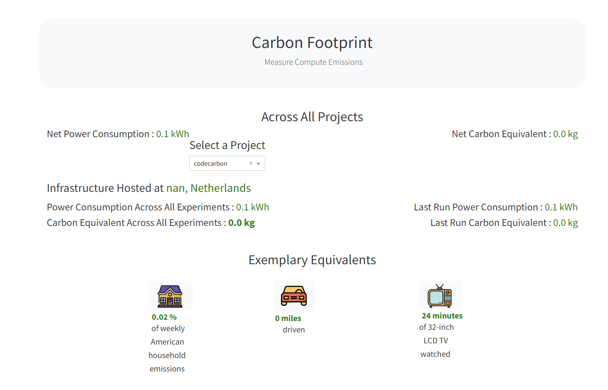

# Neuromorphic Computing for Sustainable AI: SNN vs CNN

*Afeef Ahmed, Vaishnav Rengan Venkatram, Bence Nyitrai*

## 📌 Project Overview

This project explores the potential of Neuromorphic Computing to create more sustainable Artificial Intelligence. We aim to build a Spiking Neural Network (SNN) based deep learning model and compare its energy efficiency during training and inference against a traditional Convolutional Neural Network (CNN).

By benchmarking these two approaches, we seek to demonstrate the event-driven advantages of SNNs in reducing computational overhead and power consumption.

## 🔄 Workflow

**Dataset:** CIFAR10

1. **Traditional CNN:** ResNet18 https://colab.research.google.com/drive/1cekVU2BJi0QA2lDNHtmvd82CJzEHD3pw#scrollTo=107b9adb

Create visualization: 
```bash
carbonboard --filepath="emissions.csv" --port=3333
```



2. **SNN:**

## ⚡ Energy Comparison Methodology


## 🛠️ Tech Stack \& Tools

* **Language:** Python
* **Deep Learning Framework:** [PyTorch](https://pytorch.org/)
* **CNN Energy Monitor:** [codecarbon](https://github.com/mlco2/codecarbon)
* **SNN Library:** [snnTorch](https://github.com/jeshraghian/snntorch)